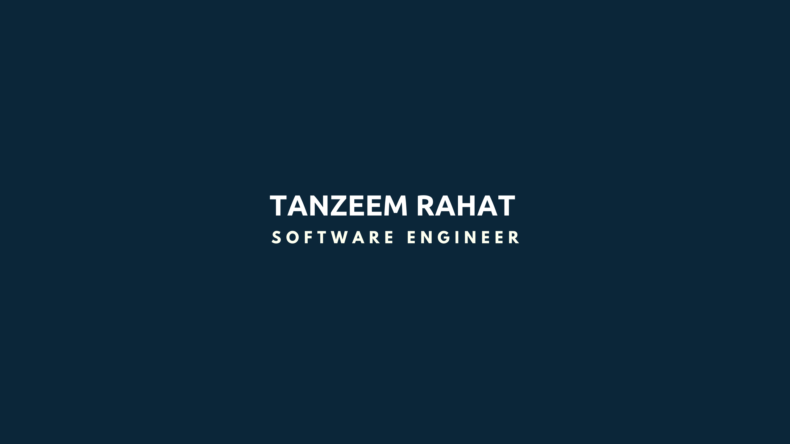

<!--  -->

<h1 align="center">Ahoy 👋 I am Tanzeem Rahat - aka TangoRomeo</h1>

## 💫 About Me:
I am a Software Engineer presently working in the field oof Web and Native application development. I am a student for life and I am still learning everything, every day, everywhere.  - 🔭 I’m currently working on **Web Development**  - 🌱 I’m currently learning **TensorFlow, Solidity and web3.js**  - 👯 I’m looking to collaborate on **Machine learning and Blockchain related researches**  - 🤝 I’m looking for help with **Designing blockchain based system**  - 👨‍💻 All of my projects are available at [https://tanzeemrahat.vercel.app/](https://tanzeemrahat.vercel.app/)  - 💬 Ask me about **react, node and django**  - 📫 Reach me at **tanzeemrahat80@gmail.com**

## 🌐 Socials:
  

# 💻 Languages and Frameworks:
                                   
# 📊 GitHub Stats:
 
 

---

  

